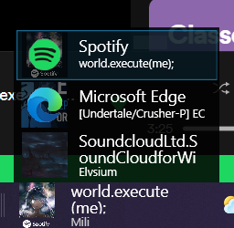
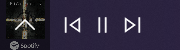
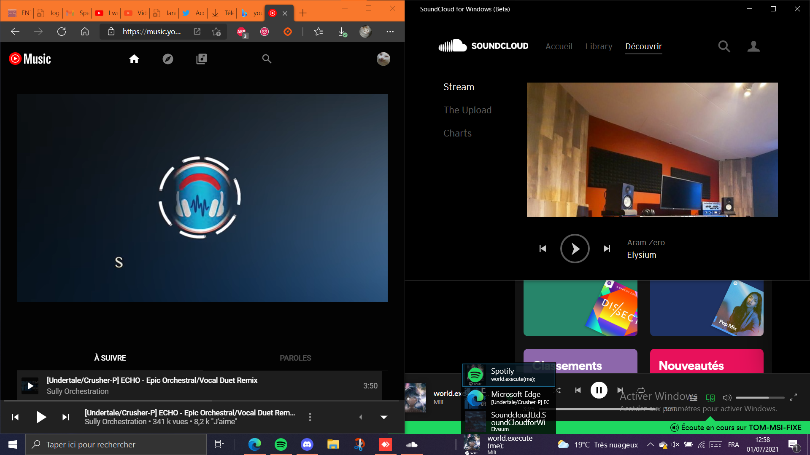

# DeskBand-Media-Controls
Control your music from your taskbar.

[Website](https://tom60chat.wixsite.com/katycorp/post/deskband-media-controls-1?lang=en)

[Download](https://github.com/Tom60chat/DeskBand-Media-Controls/releases/tag/release)

Not open source yet, as I don't yet know how licensing and copyrights work with open source.

## Features
- Displays your music (Thumbnail, Title, Artist)
- Control your music (Play, Pause, Previous, Next)
- Support all music players (Spotify, SoundCloud, Deezer, Chrome/Chromium based - Edge - Opera, etc)

## Screenshots

